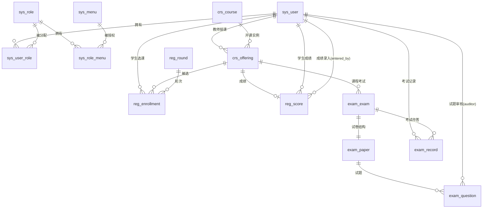
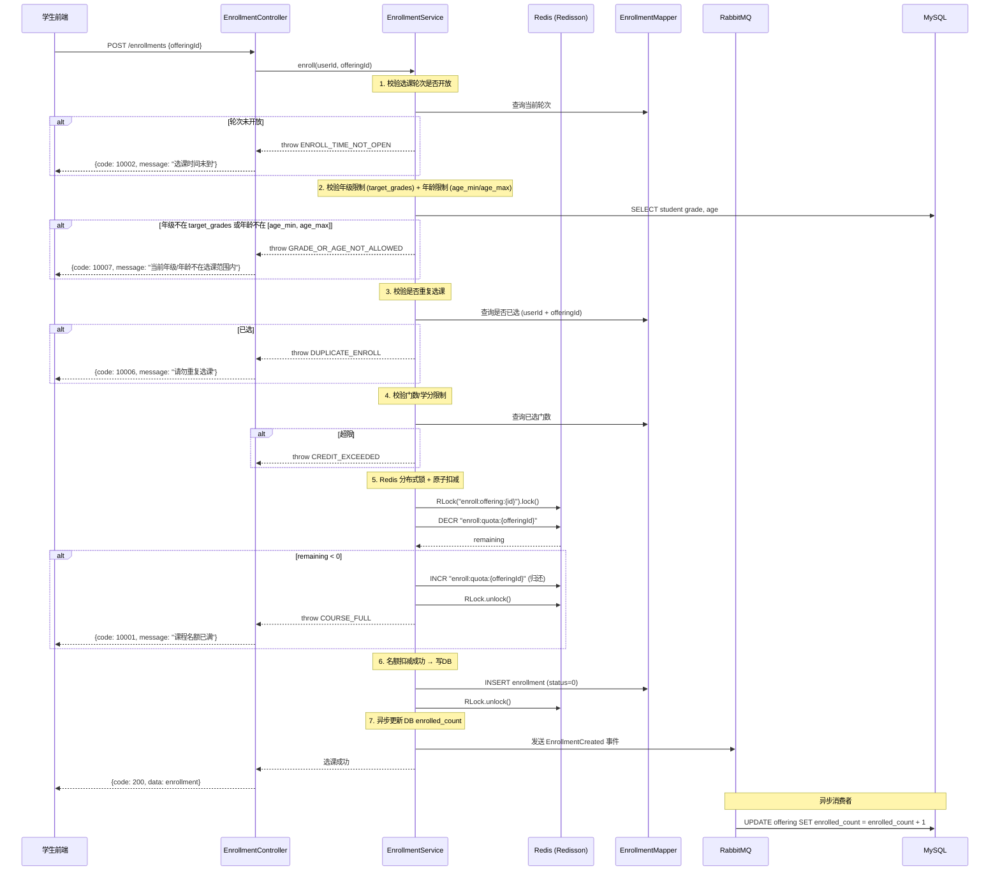
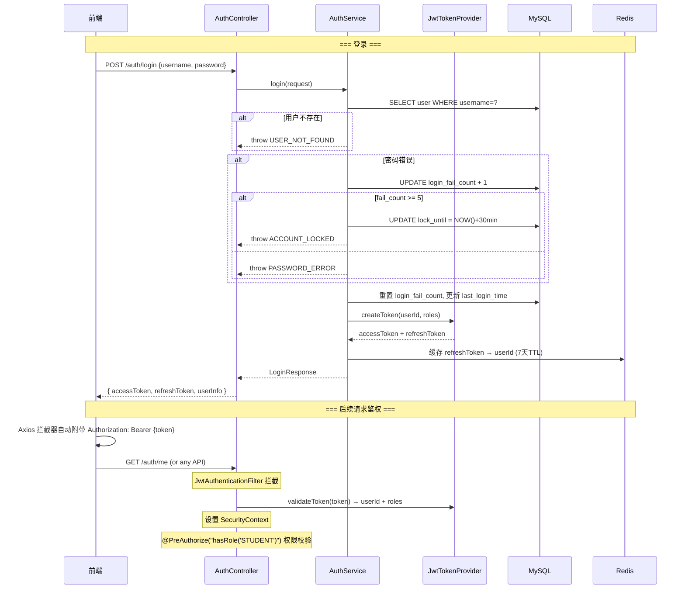
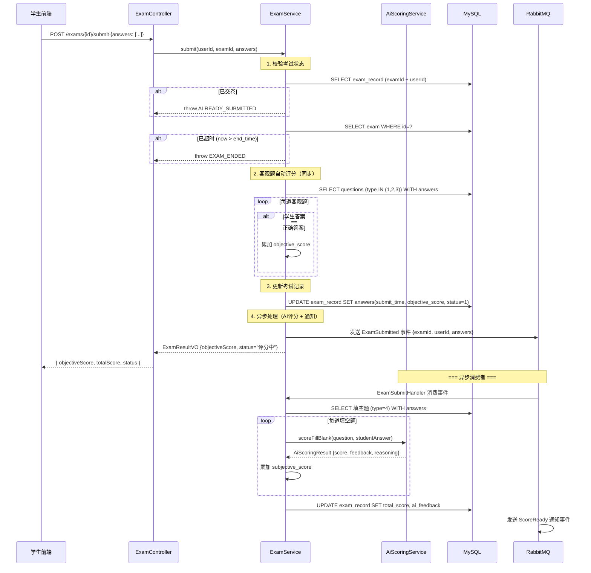
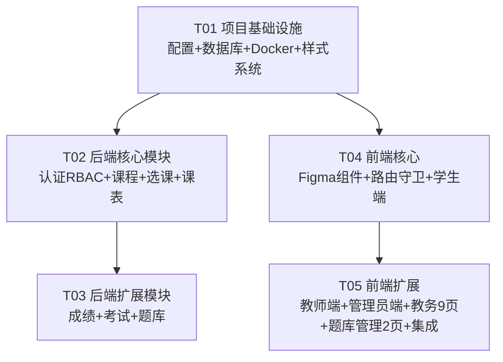

# 智教通（Smart-Edu-Scheduler）V1.0 MVP — 系统架构设计

**版本**：V1.0-ARCHITECTURE-FINAL  
**作者**：架构师 · 高见远  
**日期**：2026-07-06（更新于同日，8条决策确认后）  
**文档类型**：系统架构设计 + 任务分解（面向开发团队，已确认可开工）

---

## Part A: 系统架构设计

---

## 1. 实现方案

### 1.1 整体分层架构

```
┌─────────────────────────────────────────────────────────────┐
│                    前端 (Vue 3 + Vite 6)                     │
│  Login ──→ AppLayout(玻璃态侧边栏+顶栏) ──→ 16个业务页面      │
│  Axios 拦截器(JWT) → Pinia 状态管理 → Element Plus 组件库     │
└────────────────────────┬────────────────────────────────────┘
                         │ HTTP REST + JWT Bearer Token
                         ▼
┌─────────────────────────────────────────────────────────────┐
│               后端 (Spring Boot 3.4.3 + Java 21)             │
│                                                             │
│  ┌──────────┐  ┌──────────┐  ┌──────────┐  ┌──────────┐   │
│  │ Controller│  │ Controller│  │ Controller│  │ Controller│  │
│  │  Auth     │  │  Course   │  │  Exam     │  │  System   │  │
│  └─────┬─────┘  └─────┬─────┘  └─────┬─────┘  └─────┬─────┘  │
│        │              │              │              │        │
│  ┌─────▼─────┐  ┌─────▼─────┐  ┌─────▼─────┐  ┌─────▼─────┐ │
│  │  Service   │  │  Service   │  │  Service   │  │  Service  │ │
│  │  AuthSvc   │  │  CourseSvc │  │  ExamSvc   │  │  UserSvc  │ │
│  │  RBAC +    │  │  选课抢课   │  │  考试+评分  │  │  用户CRUD │ │
│  │  JWT签发   │  │  课表查询   │  │  题库管理   │  │  轮次配置 │ │
│  └─────┬─────┘  └─────┬─────┘  └─────┬─────┘  └─────┬─────┘ │
│        │              │              │              │        │
│  ┌─────▼──────────────▼──────────────▼──────────────▼─────┐ │
│  │              Mapper 层 (MyBatis-Plus)                   │ │
│  │  BaseMapper<T> + 自定义 XML（复杂查询）                   │ │
│  └────────────────────────┬───────────────────────────────┘ │
│                           │ JDBC / Redis / RabbitMQ          │
└───────────────────────────┼───────────────────────────────────┘
                            │
        ┌───────────────────┼───────────────────┐
        ▼                   ▼                   ▼
   ┌─────────┐       ┌──────────┐       ┌──────────┐
   │ MySQL 8 │       │ Redis 7  │       │ RabbitMQ │
   │ :3308   │       │ :6379    │       │ :5672    │
   └─────────┘       └──────────┘       └──────────┘
```

### 1.2 核心技术选型说明

| 技术点 | 选型 | 理由 |
|--------|------|------|
| **后端框架** | Spring Boot 3.4.3 | 已有基础设施，Java 21 虚拟线程天然支持高并发 |
| **ORM** | MyBatis-Plus 3.5.9 | 已有配置，BaseMapper 自动 CRUD + 逻辑删除 + 分页插件 |
| **认证** | Spring Security + JJWT 0.12.6 | 已有 SecurityConfig 骨架，JWT 无状态适合分布式 |
| **RBAC** | Spring Security `@PreAuthorize` + 自定义注解 | 方法级权限控制，结合数据库角色-菜单表 |
| **分布式锁** | Redisson 3.40.2 | 已有依赖，用于选课名额原子扣减（替代 Redis Lua 脚本） |
| **缓存** | Redis + Spring Cache | 课程列表缓存、选课轮次状态缓存 |
| **消息队列** | RabbitMQ | 已有依赖，V1.0 正式启用：选课异步落库、考试交卷异步处理、成绩计算异步、通知推送（见 §1.4） |
| **API 文档** | Knife4j 4.5.0 | 已有依赖，自动生成 Swagger 文档 |
| **Excel 导入** | EasyExcel | 新增依赖，轻量级 Excel 解析（题库/成绩/用户批量导入） |
| **前端框架** | Vue 3 + Vite 6 + TypeScript | 已有项目骨架 |
| **UI 组件库** | Element Plus 2.9 | 已有配置，按需自动导入 |
| **状态管理** | Pinia 2.3 | 已有配置 |
| **图表** | ECharts 5.5 + vue-echarts | 已有依赖，用于工作台看板 |
| **CSS 预处理** | SCSS | 已有配置，Figma 紫色毛玻璃效果大量使用 SCSS 嵌套/mixin |

### 1.3 选课高并发方案

```
用户点击"选课"
    │
    ▼
Redisson RLock("enroll:offering:{id}")  ← 分布式锁，锁粒度=单课程
    │
    ▼
Redis → DECR "enroll:quota:{offeringId}"  ← 原子扣减
    │
    ├── 结果 ≥ 0 → 写入选课记录(MySQL) + 发送确认消息(RabbitMQ)
    │
    └── 结果 < 0 → INCR 归还 + 抛出 COURSE_FULL 异常
```

- **为什么不用数据库行锁？** MySQL 行锁在 200 并发下性能急剧下降，200 人抢 50 名额场景下 Redis 原子操作表现更优
- **最终一致性**：Redis 扣减成功后，写 MySQL 失败则通过补偿任务回滚 Redis 计数

### 1.4 RabbitMQ 使用场景定义

> 决策 Q4：保留 RabbitMQ，虽然初期部署麻烦但后期一劳永逸。以下为 V1.0 已启用的 MQ 场景：

| 场景 | 交换机 | 队列 | 消费者 | 说明 |
|------|--------|------|--------|------|
| **选课异步落库** | `enrollment.exchange` | `enrollment.sync.queue` | `EnrollmentQuotaSyncHandler` | 选课成功后异步更新 `crs_offering.enrolled_count`，解耦 Redis 扣减与 DB 写入 |
| **考试交卷异步处理** | `exam.exchange` | `exam.submit.queue` | `ExamSubmitHandler` | 交卷后异步执行客观题评分 + 填空题 AI 评分，避免阻塞 HTTP 响应 |
| **成绩计算异步** | `score.exchange` | `score.calc.queue` | `ScoreCalcHandler` | 成绩发布后异步计算 GPA、排名等聚合数据 |
| **通知推送** | `notification.exchange` | `notification.push.queue` | `NotificationPushHandler` | 选课结果、成绩发布、审核结果等通知异步推送（站内信 + 可选邮件） |
| **DLX 死信** | `dlx.exchange` | `dlx.queue` | `DlxHandler` | 所有队列统一配置死信交换机，失败消息自动进入 DLX 供人工排查 |

> **降级策略**：若 RabbitMQ 不可用，Spring 自动配置 `@ConditionalOnProperty` 降级为 `@Async` + 虚拟线程直接调用，保证核心流程不中断。Docker Compose 中 RabbitMQ 为必选项（非可选）。

---

## 2. 数据库设计

### 2.1 ER 关系图



### 2.2 表清单与核心字段

#### 系统模块 (sys_)

| 表名 | 核心字段 | 说明 |
|------|---------|------|
| **sys_user** | id, username, password, real_name, user_type(1-5), department, major, phone, email, status(0-2), login_fail_count, lock_until, last_login_time | 5角色用户表，user_type: 1学生/2教师/3教务/4管理员/5题库管理员 |
| **sys_role** | id, role_code, role_name, description, status | RBAC 角色定义 |
| **sys_menu** | id, parent_id, menu_name, path, component, icon, menu_type(M/C/B), permission, sort_order, visible, status | 动态菜单+按钮权限 |
| **sys_user_role** | id, user_id, role_id | 用户-角色关联 |
| **sys_role_menu** | id, role_id, menu_id | 角色-菜单关联 |

#### 课程模块 (crs_)

| 表名 | 核心字段 | 说明 |
|------|---------|------|
| **crs_course** | id, course_code, course_name, credit, description, category, syllabus | 课程库（定义层） |
| **crs_offering** | id, course_id, teacher_id, semester, weekday(1-7), period_start, period_end, location, capacity, enrolled_count, status(0=待审/1=通过/2=驳回), audit_comment | 开课实例（学期层），enrolled_count 由 Redis 同步 |

#### 选课模块 (reg_)

| 表名 | 核心字段 | 说明 |
|------|---------|------|
| **reg_round** | id, round_name, start_time, end_time, max_credits, max_courses, target_grades(JSON), age_min, age_max, status(0-2) | 选课轮次配置。决策 Q5：增加年龄限制 age_min/age_max |
| **reg_enrollment** | id, student_id, offering_id, round_id, status(0=正常/1=已退/2=待审核), created_at, dropped_at | 选课记录 |
| **reg_score** | id, student_id, offering_id, raw_score(原始百分制分数，用于排名), grade_level(五级制: 优秀/良好/中等/及格/不及格), gpa, rank_in_class, status(0=草稿/1=已发布), entered_by | 成绩记录。决策 Q3：五级制展示，raw_score 排名 |

#### 考试模块 (exam_)

| 表名 | 核心字段 | 说明 |
|------|---------|------|
| **exam_exam** | id, offering_id, exam_name, start_time, end_time, duration_minutes, total_score, status | 考试定义 |
| **exam_paper** | id, exam_id, paper_title, question_count, total_score | 试卷结构 |
| **exam_paper_question** | id, paper_id, question_id, question_order, score | 试卷-试题关联 |
| **exam_question** | id, question_type(1-4), content, options(JSON), answer, analysis, difficulty(1-5), knowledge_point, created_by, scope(1=全局/2=个人), audit_status(0=待审/1=通过/2=驳回), auditor_id, audit_time | 题库。决策 Q2：scope 区分全局/个人；个人设为"公开"需审核 |
| **exam_record** | id, exam_id, student_id, start_time, submit_time, answers(JSON), objective_score, total_score, status(0-2) | 考试记录 |

### 2.3 关键索引策略

| 表 | 索引 | 用途 |
|----|------|------|
| sys_user | UNIQUE(username), INDEX(user_type, status) | 登录查询 + 角色筛选 |
| crs_offering | INDEX(status, semester), INDEX(teacher_id) | 课程广场列表 + 教师课表 |
| reg_enrollment | UNIQUE(student_id, offering_id), INDEX(student_id, status) | 防重复选课 + 查询我的课程 |
| reg_score | UNIQUE(student_id, offering_id) | 一人一课一成绩 |
| exam_question | INDEX(question_type, scope, audit_status), INDEX(created_by) | 按题型/范围/审核状态筛选 |
| exam_record | UNIQUE(exam_id, student_id) | 一人一考一记录 |
| reg_round | INDEX(status) | 按状态筛选活跃轮次 |

---

## 3. 文件列表

> 标注：**N**=New（新建），**M**=Modify（修改）

### 3.1 项目根目录 — Docker & 部署

| 文件 | 状态 | 说明 |
|------|------|------|
| `docker-compose.yml` | **N** | MySQL:3308 + Redis:6379 + Backend:8080 + Frontend:8083 |
| `backend/Dockerfile` | **N** | 多阶段构建：maven → jre-alpine |
| `frontend/Dockerfile` | **N** | 多阶段构建：node → nginx:alpine |
| `frontend/nginx.conf` | **N** | SPA 路由 + /api 反向代理 |
| `.env` | **N** | 环境变量（数据库密码等） |

### 3.2 后端 — 配置文件

| 文件 | 状态 | 说明 |
|------|------|------|
| `smart-edu-backend/pom.xml` | **M** | 新增 EasyExcel 依赖 |
| `smart-edu-backend/src/main/resources/application.yml` | **M** | 修正 MySQL 端口 → 3308；添加 Redis 密码；新增 docker profile；分页插件配置 |
| `smart-edu-backend/src/main/resources/application-docker.yml` | **N** | Docker 环境配置（host 指向容器名） |
| `smart-edu-backend/src/main/resources/db/migration/V1.0__init.sql` | **N** | 全量 DDL + 种子数据 |

### 3.3 后端 — 安全模块 (auth)

| 文件 | 状态 | 说明 |
|------|------|------|
| `src/main/java/com/smartedu/config/SecurityConfig.java` | **M** | 注册 JWT 过滤器，细化权限路由 |
| `src/main/java/com/smartedu/security/JwtTokenProvider.java` | **N** | JWT 签发/验证/刷新 |
| `src/main/java/com/smartedu/security/JwtAuthenticationFilter.java` | **N** | OncePerRequestFilter，解析 Token 注入 SecurityContext |
| `src/main/java/com/smartedu/security/UserDetailsServiceImpl.java` | **N** | 实现 UserDetailsService，从 DB 加载用户+角色 |
| `src/main/java/com/smartedu/controller/AuthController.java` | **N** | /api/v1/auth/login, /logout, /refresh, /me |
| `src/main/java/com/smartedu/service/AuthService.java` | **N** | 登录校验（密码+锁定）、Token 管理 |
| `src/main/java/com/smartedu/model/dto/LoginRequest.java` | **N** | 登录请求 DTO |
| `src/main/java/com/smartedu/model/dto/LoginResponse.java` | **N** | 登录响应（accessToken + refreshToken + userInfo） |

### 3.4 后端 — 用户模块 (user)

| 文件 | 状态 | 说明 |
|------|------|------|
| `src/main/java/com/smartedu/entity/SysUser.java` | **N** | 用户实体（MyBatis-Plus） |
| `src/main/java/com/smartedu/entity/SysRole.java` | **N** | 角色实体 |
| `src/main/java/com/smartedu/entity/SysMenu.java` | **N** | 菜单实体 |
| `src/main/java/com/smartedu/mapper/SysUserMapper.java` | **N** | 用户 Mapper |
| `src/main/java/com/smartedu/mapper/SysRoleMapper.java` | **N** | 角色 Mapper |
| `src/main/java/com/smartedu/mapper/SysMenuMapper.java` | **N** | 菜单 Mapper |
| `src/main/java/com/smartedu/service/UserService.java` | **N** | 用户 CRUD + 状态管理 |
| `src/main/java/com/smartedu/service/MenuService.java` | **N** | 按角色获取菜单树 |
| `src/main/java/com/smartedu/controller/UserController.java` | **N** | /api/v1/admin/users CRUD |
| `src/main/java/com/smartedu/controller/MenuController.java` | **N** | /api/v1/menus/my 获取当前用户菜单 |

### 3.5 后端 — 课程 & 选课模块 (course + enrollment)

| 文件 | 状态 | 说明 |
|------|------|------|
| `src/main/java/com/smartedu/entity/CrsCourse.java` | **N** | 课程实体 |
| `src/main/java/com/smartedu/entity/CrsOffering.java` | **N** | 开课实例实体 |
| `src/main/java/com/smartedu/entity/RegEnrollment.java` | **N** | 选课记录实体 |
| `src/main/java/com/smartedu/entity/RegRound.java` | **N** | 选课轮次实体 |
| `src/main/java/com/smartedu/mapper/CrsCourseMapper.java` | **N** | 课程 Mapper |
| `src/main/java/com/smartedu/mapper/CrsOfferingMapper.java` | **N** | 开课 Mapper（含分页搜索） |
| `src/main/java/com/smartedu/mapper/RegEnrollmentMapper.java` | **N** | 选课 Mapper |
| `src/main/java/com/smartedu/mapper/RegRoundMapper.java` | **N** | 轮次 Mapper |
| `src/main/java/com/smartedu/service/CourseService.java` | **N** | 课程广场分页搜索、课程审核 |
| `src/main/java/com/smartedu/service/EnrollmentService.java` | **N** | 选课抢课（Redis 分布式锁+原子扣减）、退课 |
| `src/main/java/com/smartedu/service/ScheduleService.java` | **N** | 课表查询（按学生/教师 + 学期） |
| `src/main/java/com/smartedu/service/RoundService.java` | **N** | 选课轮次 CRUD |
| `src/main/java/com/smartedu/controller/CourseController.java` | **N** | /api/v1/courses/offerings 分页列表+详情 |
| `src/main/java/com/smartedu/controller/EnrollmentController.java` | **N** | /api/v1/enrollments 选课/退课/我的选课 |
| `src/main/java/com/smartedu/controller/ScheduleController.java` | **N** | /api/v1/schedules 课表查询 |
| `src/main/java/com/smartedu/controller/CourseApprovalController.java` | **N** | /api/v1/approvals 课程审核 |
| `src/main/java/com/smartedu/controller/RoundController.java` | **N** | /api/v1/academic/rounds 轮次 CRUD |
| `src/main/java/com/smartedu/model/dto/CourseOfferingQuery.java` | **N** | 课程查询参数 |
| `src/main/java/com/smartedu/model/vo/CourseOfferingVO.java` | **N** | 课程列表视图对象 |
| `src/main/java/com/smartedu/model/vo/ScheduleVO.java` | **N** | 课表视图对象 |

### 3.6 后端 — 成绩模块 (score)

| 文件 | 状态 | 说明 |
|------|------|------|
| `src/main/java/com/smartedu/entity/RegScore.java` | **N** | 成绩实体 |
| `src/main/java/com/smartedu/mapper/RegScoreMapper.java` | **N** | 成绩 Mapper |
| `src/main/java/com/smartedu/service/ScoreService.java` | **N** | 成绩录入/批量导入/查询 |
| `src/main/java/com/smartedu/controller/ScoreController.java` | **N** | /api/v1/scores 录入/查询/导入 |
| `src/main/java/com/smartedu/model/dto/ScoreImportDTO.java` | **N** | 批量导入行数据 |

### 3.7 后端 — 考试 & 题库模块 (exam)

| 文件 | 状态 | 说明 |
|------|------|------|
| `src/main/java/com/smartedu/entity/ExamExam.java` | **N** | 考试实体 |
| `src/main/java/com/smartedu/entity/ExamPaper.java` | **N** | 试卷实体 |
| `src/main/java/com/smartedu/entity/ExamQuestion.java` | **N** | 试题实体 |
| `src/main/java/com/smartedu/entity/ExamRecord.java` | **N** | 考试记录实体 |
| `src/main/java/com/smartedu/mapper/ExamExamMapper.java` | **N** | 考试 Mapper |
| `src/main/java/com/smartedu/mapper/ExamQuestionMapper.java` | **N** | 试题 Mapper |
| `src/main/java/com/smartedu/mapper/ExamRecordMapper.java` | **N** | 考试记录 Mapper |
| `src/main/java/com/smartedu/service/ExamService.java` | **N** | 考试管理、开始/交卷、客观题评分 |
| `src/main/java/com/smartedu/service/QuestionService.java` | **N** | 题库 CRUD + Excel 批量导入 + 题库审核 |
| `src/main/java/com/smartedu/service/AiScoringService.java` | **N** | AI 评分接口（策略模式），V1.0 Mock 实现 |
| `src/main/java/com/smartedu/service/impl/MockAiScoringServiceImpl.java` | **N** | Mock AI 评分：精确匹配 + 关键词模糊（忽略空格/大小写） |
| `src/main/java/com/smartedu/controller/ExamController.java` | **N** | /api/v1/exams 考试操作 |
| `src/main/java/com/smartedu/controller/QuestionController.java` | **N** | /api/v1/questions 题库 CRUD + 导入/导出 |
| `src/main/java/com/smartedu/model/dto/ExamSubmitRequest.java` | **N** | 交卷请求 DTO |
| `src/main/java/com/smartedu/model/vo/ExamResultVO.java` | **N** | 考试结果 VO |

### 3.8 后端 — 通用配置与基础设施

| 文件 | 状态 | 说明 |
|------|------|------|
| `src/main/java/com/smartedu/config/MybatisPlusConfig.java` | **N** | 分页插件 + 乐观锁配置 |
| `src/main/java/com/smartedu/config/RedisConfig.java` | **N** | Redis 序列化配置（Jackson2Json） |
| `src/main/java/com/smartedu/config/CorsConfig.java` | **N** | 跨域配置（开发环境） |
| `src/main/java/com/smartedu/common/PageResult.java` | **N** | 统一分页响应 {total, page, size, records} |
| `src/main/java/com/smartedu/common/annotation/RequireRole.java` | **N** | 自定义角色注解（AOP 切面校验） |
| `src/main/java/com/smartedu/common/aspect/RoleAspect.java` | **N** | 角色校验切面 |
| `src/main/java/com/smartedu/config/RabbitMQConfig.java` | **N** | RabbitMQ 交换机/队列/绑定声明 + 死信配置 |
| `src/main/java/com/smartedu/handler/EnrollmentQuotaSyncHandler.java` | **N** | RabbitMQ 消费者：异步同步 Redis 名额到 DB |
| `src/main/java/com/smartedu/handler/ExamSubmitHandler.java` | **N** | RabbitMQ 消费者：异步处理交卷评分 |
| `src/main/java/com/smartedu/handler/ScoreCalcHandler.java` | **N** | RabbitMQ 消费者：异步计算 GPA + 排名 |
| `src/main/java/com/smartedu/handler/NotificationPushHandler.java` | **N** | RabbitMQ 消费者：异步推送通知 |
| `src/main/java/com/smartedu/model/dto/AiScoringRequest.java` | **N** | AI 评分请求 DTO（题目 + 学生答案） |
| `src/main/java/com/smartedu/model/vo/AiScoringResult.java` | **N** | AI 评分结果 VO（得分 + 反馈 + 推理） |

### 3.9 前端 — 样式与基础

| 文件 | 状态 | 说明 |
|------|------|------|
| `smart-edu-frontend/index.html` | **M** | 引入 Space Grotesk Google Fonts |
| `smart-edu-frontend/src/styles/global.scss` | **M** | 完全重写为 Figma 紫色毛玻璃色彩系统 |
| `smart-edu-frontend/src/styles/_variables.scss` | **N** | SCSS 变量/mixin 集中定义 |
| `smart-edu-frontend/src/styles/_glassmorphism.scss` | **N** | 毛玻璃卡片/侧边栏/按钮 mixin |
| `smart-edu-frontend/src/styles/_animations.scss` | **N** | 光球漂浮/呼吸灯/菜单动效/光圈脉冲 @keyframes |
| `smart-edu-frontend/public/cursor.svg` | **N** | 自定义紫色圆形光标 |
| `smart-edu-frontend/public/cursor-hover.svg` | **N** | Hover 态光标 |
| `smart-edu-frontend/vite.config.ts` | **M** | 开发端口改为 8083；SCSS additionalData 注入变量 |

### 3.10 前端 — 核心框架文件

| 文件 | 状态 | 说明 |
|------|------|------|
| `smart-edu-frontend/src/main.ts` | **M** | 注册自定义光标样式、全局 SCSS 导入调整 |
| `smart-edu-frontend/src/router/index.ts` | **M** | 新增 4 条路由 + 角色路由守卫 + Token 校验 |
| `smart-edu-frontend/src/api/index.ts` | **M** | 扩展 API 定义：用户管理/课程审核/轮次/成绩录入/题库/考试 |
| `smart-edu-frontend/src/stores/user.ts` | **M** | 新增 fetchUserInfo、角色码映射完善 |
| `smart-edu-frontend/src/components/AppLayout.vue` | **M** | 完全重写为玻璃态侧边栏+顶栏，5角色菜单，光球背景层 |
| `smart-edu-frontend/src/components/GlassCard.vue` | **N** | 毛玻璃卡片通用组件 |
| `smart-edu-frontend/src/components/StatCard.vue` | **N** | 统计卡片（3D 图标 + 数值） |
| `smart-edu-frontend/src/components/ClayIcon.vue` | **N** | 黏土 3D 图标组件 |
| `smart-edu-frontend/src/components/SkeletonPage.vue` | **N** | 骨架页通用组件（接收 title prop，显示"功能开发中"） |

### 3.11 前端 — 页面文件（业务逻辑填充 + Figma 风格重绘）

| 文件 | 状态 | 说明 |
|------|------|------|
| `src/views/Login.vue` | **M** | 紫色毛玻璃登录页，背景光球 |
| **学生端** | | |
| `src/views/student/Dashboard.vue` | **M** | 统计卡片 + 快捷入口 + 课表预览 |
| `src/views/student/CourseMarket.vue` | **M** | 搜索栏 + 分类筛选 + 课程卡片列表 + 分页 |
| `src/views/student/MySchedule.vue` | **M** | 周视图课表（周一~周日，节次1-8） |
| `src/views/student/MyEnrollments.vue` | **M** | 已选课程列表 + 退课按钮 |
| `src/views/student/MyScores.vue` | **M** | 成绩表格（课程/学分/成绩/GPA）+ GPA 汇总 |
| `src/views/student/ExamCenter.vue` | **M** | 待考列表 + 进入考试 + 考试倒计时作答页 + 结果页 |
| **教师端** | | |
| `src/views/teacher/Dashboard.vue` | **M** | 授课统计 + 待办事项 |
| `src/views/teacher/ScoreEntry.vue` | **M** | 按课程选择 → 学生列表 → 成绩录入/Excel 导入 |
| `src/views/teacher/QuestionBank.vue` | **M** | 试题表格 + 筛选 + CRUD 弹窗 + 批量导入/导出 |
| **管理员端** | | |
| `src/views/admin/Dashboard.vue` | **M** | 系统概览统计 |
| `src/views/admin/UserManagement.vue` | **M** | 用户表格 + 搜索 + 新增/编辑弹窗 + 状态切换 |
| `src/views/admin/CourseApproval.vue` | **M** | 待审课程列表 → 查看详情 → 通过/驳回弹窗 |
| **新建页面** | | |
| `src/views/academic/Dashboard.vue` | **N** | 教务工作台：待审课程数 + 选课轮次状态 + 数据概览 |
| `src/views/academic/RoundConfig.vue` | **N** | 轮次列表 + 新增/编辑轮次（时间范围/年级/门数限制/年龄限制） |
| `src/views/academic/ScheduleManagement.vue` | **N** | **骨架页**：排课管理（功能开发中） |
| `src/views/academic/ExamManagement.vue` | **N** | **骨架页**：考试管理（功能开发中） |
| `src/views/academic/ScoreApproval.vue` | **N** | **骨架页**：成绩审核（功能开发中） |
| `src/views/academic/TeachingEvaluation.vue` | **N** | **骨架页**：教学评价（功能开发中） |
| `src/views/academic/EnrollmentMonitor.vue` | **N** | **骨架页**：选课监控（功能开发中） |
| `src/views/academic/TrainingPlan.vue` | **N** | **骨架页**：培养方案（功能开发中） |
| `src/views/academic/NewStudentImport.vue` | **N** | **骨架页**：新生导入（功能开发中） |
| `src/views/qb-admin/Dashboard.vue` | **N** | 题库管理工作台：题库统计 + 知识点管理 |
| `src/views/qb-admin/QuestionAudit.vue` | **N** | 题库审核：待审试题列表 → 审核通过/驳回 |

---

## 4. 核心 REST API 设计

> 所有接口以 `/api/v1` 为前缀。响应格式：`{ code: 200, message: "success", data: ... }`

### 4.1 认证模块

| 方法 | 路径 | 说明 | 权限 |
|------|------|------|------|
| POST | `/auth/login` | 登录，返回 accessToken + refreshToken + userInfo | 公开 |
| POST | `/auth/logout` | 登出，使 Token 失效 | 登录 |
| POST | `/auth/refresh` | 刷新 Token | 公开（校验 refreshToken） |
| GET | `/auth/me` | 获取当前用户信息 | 登录 |

### 4.2 菜单模块

| 方法 | 路径 | 说明 | 权限 |
|------|------|------|------|
| GET | `/menus/my` | 获取当前角色菜单树 | 登录 |

### 4.3 课程模块

| 方法 | 路径 | 说明 | 权限 |
|------|------|------|------|
| GET | `/courses/offerings` | 分页搜索课程（?keyword=&category=&page=&size=） | 登录 |
| GET | `/courses/offerings/{id}` | 课程详情 | 登录 |

### 4.4 选课模块 (P0 核心)

| 方法 | 路径 | 说明 | 权限 |
|------|------|------|------|
| POST | `/enrollments` | 选课 { offeringId } → Redis 原子扣减 | 学生 |
| DELETE | `/enrollments/{id}` | 退课 → Redis 原子归还 | 学生 |
| GET | `/enrollments/my` | 我的选课列表 | 学生 |
| GET | `/enrollments/log` | 选课操作日志 | 学生 |

### 4.5 课表模块

| 方法 | 路径 | 说明 | 权限 |
|------|------|------|------|
| GET | `/schedules/my` | 当前用户课表（按角色：学生看自己，教师看授课） | 登录 |
| GET | `/schedules/student/{studentId}` | 指定学生课表 | 教师/教务 |

### 4.6 课程审核模块

| 方法 | 路径 | 说明 | 权限 |
|------|------|------|------|
| GET | `/approvals/offerings` | 待审核课程列表 | 教务/管理员 |
| GET | `/approvals/offerings/{id}` | 审核详情 | 教务/管理员 |
| PUT | `/approvals/offerings/{id}/approve` | 通过 { comment? } | 教务/管理员 |
| PUT | `/approvals/offerings/{id}/reject` | 驳回 { comment } | 教务/管理员 |

### 4.7 成绩模块

| 方法 | 路径 | 说明 | 权限 |
|------|------|------|------|
| GET | `/scores/my` | 我的成绩列表 | 学生 |
| GET | `/scores/offering/{offeringId}` | 按课程查看学生成绩 | 教师 |
| PUT | `/scores/{id}` | 录入/修改单条成绩 | 教师 |
| POST | `/scores/batch` | 批量录入成绩 { scores: [{studentId, scoreValue, scoreType}] } | 教师 |
| POST | `/scores/import` | Excel 批量导入成绩 | 教师 |
| PUT | `/scores/{id}/publish` | 发布成绩 | 教师 |

### 4.8 考试模块

| 方法 | 路径 | 说明 | 权限 |
|------|------|------|------|
| GET | `/exams` | 考试列表（我的待考/已完成） | 登录 |
| GET | `/exams/{id}` | 考试详情（含试卷试题，不含答案） | 登录 |
| POST | `/exams/{id}/start` | 开始考试（记录开始时间） | 学生 |
| POST | `/exams/{id}/submit` | 提交答案 → 客观题自动评分 + 填空题 AI 评分（异步） | 学生 |
| GET | `/exams/{id}/results/my` | 查看我的考试结果（含 AI 评分反馈） | 学生 |

### 4.9 题库模块

| 方法 | 路径 | 说明 | 权限 |
|------|------|------|------|
| GET | `/questions` | 分页搜索试题（?type=&keyword=&scope=&auditStatus=&page=&size=） | 教师/题库管理员 |
| GET | `/questions/{id}` | 试题详情 | 教师/题库管理员 |
| POST | `/questions` | 新增试题（scope=2 个人，设为公开自动触发审核） | 教师/题库管理员 |
| PUT | `/questions/{id}` | 编辑试题 | 教师/题库管理员 |
| DELETE | `/questions/{id}` | 删除试题 | 教师/题库管理员 |
| POST | `/questions/import` | Excel 批量导入 | 教师/题库管理员 |
| GET | `/questions/template` | 下载导入模板 | 教师/题库管理员 |
| GET | `/questions/audit/list` | 待审核试题列表（按 scope=1 且 audit_status=0） | 题库管理员 |
| PUT | `/questions/{id}/audit` | 审核试题 { auditStatus, comment } | 题库管理员 |

### 4.10 用户管理模块

| 方法 | 路径 | 说明 | 权限 |
|------|------|------|------|
| GET | `/admin/users` | 分页查询用户 | 管理员 |
| POST | `/admin/users` | 新增用户 | 管理员 |
| PUT | `/admin/users/{id}` | 编辑用户 | 管理员 |
| PUT | `/admin/users/{id}/status` | 启用/禁用 { status } | 管理员 |
| DELETE | `/admin/users/{id}` | 删除用户（逻辑删除） | 管理员 |
| POST | `/admin/users/import` | 批量导入用户 | 管理员 |

### 4.11 选课轮次模块

| 方法 | 路径 | 说明 | 权限 |
|------|------|------|------|
| GET | `/academic/rounds` | 轮次列表 | 教务 |
| POST | `/academic/rounds` | 创建轮次 {roundName, startTime, endTime, maxCredits, maxCourses, targetGrades, ageMin, ageMax} | 教务 |
| PUT | `/academic/rounds/{id}` | 编辑轮次 | 教务 |
| DELETE | `/academic/rounds/{id}` | 删除轮次 | 教务 |
| PUT | `/academic/rounds/{id}/status` | 切换轮次状态 | 教务 |

### 4.12 教务扩展模块（V1.0 骨架，路由+菜单就位）

> 决策 Q8：以下页面 V1.0 为骨架页（显示"功能开发中"），但路由和侧边栏菜单必须就位，为后续迭代预留。

| 方法 | 路径 | 说明 | 权限 |
|------|------|------|------|
| GET | `/academic/schedule-management` | 排课管理（骨架页） | 教务 |
| GET | `/academic/exam-management` | 考试管理（骨架页） | 教务 |
| GET | `/academic/score-approval` | 成绩审核（骨架页） | 教务 |
| GET | `/academic/teaching-evaluation` | 教学评价（骨架页） | 教务 |
| GET | `/academic/enrollment-monitor` | 选课监控（骨架页） | 教务 |
| GET | `/academic/training-plan` | 培养方案（骨架页） | 教务 |
| GET | `/academic/new-student-import` | 新生导入（骨架页） | 教务 |

### 4.13 题库审核模块

| 方法 | 路径 | 说明 | 权限 |
|------|------|------|------|
| GET | `/qb-admin/questions/audit` | 题库审核（骨架页可复用 §4.9 题库审核接口） | 题库管理员 |

---

## 5. 程序调用流程（关键场景）

### 5.1 选课抢课流程



### 5.2 用户登录 + RBAC 鉴权流程



### 5.3 考试提交 + 自动评分流程



---

## 6. 已确认事项（最终决策）

> 以下 8 项已由产品负责人最终确认，所有相关设计已按决策更新。

| 编号 | 问题 | 最终决策 | 落实位置 |
|:--:|------|------|------|
| Q1 | 教务/Admin 审核页面 | **共用**同一页面，但**权限分离**（数据范围隔离）：教师不能看教务数据 | §6.1 数据范围隔离方案 |
| Q2 | 题库 scope | **全局+个人**。个人题库可设"公开"，公开需**提交审核** | §2.2 exam_question 表 |
| Q3 | 成绩制度 | **五级制**，但排名统计按**原始分数**排名 | §2.2 reg_score 表 |
| Q4 | RabbitMQ | **保留**。初期部署麻烦但后期一劳永逸 | §1.2, §1.4 MQ场景 |
| Q5 | 选课轮次限制 | **年级限制** + **年龄限制** | §2.2 reg_round 表 |
| Q6 | 填空题评分 | **AI大模型**评分（需接入大模型API） | §3.7, §6.2 AI评分Service |
| Q7 | 课表时间槽 | **标准8节课**（不变） | 无变更 |
| Q8 | 菜单变更 | 教务+题库管理员菜单大幅扩展（骨架页） | §3.11, §4.12, 路由表 |

### 6.1 数据范围隔离方案（Q1）

**方案选择：Service 层过滤**

```
┌─────────────────────────────────────────────────────┐
│              CourseApprovalController               │
│  @PreAuthorize("hasAnyRole('ACADEMIC','ADMIN')")   │
└────────────────────┬────────────────────────────────┘
                     │
                     ▼
┌─────────────────────────────────────────────────────┐
│              CourseApprovalService                  │
│                                                     │
│  if (currentUser.isAdmin()) {                       │
│      // Admin：查看全部待审课程                        │
│      return mapper.selectAll(status=PENDING);        │
│  } else if (currentUser.isAcademic()) {             │
│      // 教务：仅查看所属院系的待审课程                   │
│      return mapper.selectByDept(                    │
│          status=PENDING, dept=currentUser.dept);     │
│  }                                                  │
└─────────────────────────────────────────────────────┘
```

> **为什么不选 SQL 拦截？** MyBatis-Plus 插件拦截器实现复杂且隐式，Service 层显式过滤更清晰，符合"显式优于隐式"原则。业务代码审计时一目了然。

### 6.2 AI 大模型评分方案（Q6）

```
┌──────────────────────────────────────────────────────┐
│                    AiScoringService                   │
│  ┌────────────────────────────────────────────────┐  │
│  │ <<interface>>                                   │  │
│  │ + scoreFillBlank(question, studentAnswer)       │  │
│  │   → AiScoringResult {score, feedback, reasoning}│  │
│  └────────────────────────────────────────────────┘  │
│                         ▲                            │
│                         │                            │
│  ┌──────────────────────┴─────────────────────────┐  │
│  │ MockAiScoringServiceImpl (V1.0)                 │  │
│  │ → 精确匹配 + 关键词模糊匹配（忽略空格/大小写）      │  │
│  └────────────────────────────────────────────────┘  │
│  ┌────────────────────────────────────────────────┐  │
│  │ OpenAiScoringServiceImpl (V2.0, 待实现)         │  │
│  │ → 调用大模型 API（GPT/Claude/文心）语义评分        │  │
│  └────────────────────────────────────────────────┘  │
└──────────────────────────────────────────────────────┘
```

> **V1.0 策略**：使用 Mock 实现（精确匹配 + 关键词模糊）。接口已抽象，V2.0 只需替换实现类即可接入大模型。

---

## Part B: 任务分解

---

## 7. 必需依赖包

### 7.1 后端 Maven 依赖（需新增）

> 现有 `pom.xml` 已覆盖绝大部分依赖，仅需新增以下：

```xml
<!-- Excel 导入导出（题库/成绩/用户批量导入） -->
<dependency>
    <groupId>com.alibaba</groupId>
    <artifactId>easyexcel</artifactId>
    <version>4.0.3</version>
</dependency>
```

### 7.2 前端 npm 依赖（需新增）

> 现有 `package.json` 已全覆盖，仅需新增一个：

```json
{
  "dependencies": {
    "xlsx": "^0.18.5"
  }
}
```

> `xlsx` 用于浏览器端读取 Excel 文件（成绩模板解析、用户批量导入预览）。

---

## 8. 任务列表

> ⚠️ **硬性规则**：共 5 个任务。每个任务 ≥ 3 个相关文件。按模块分组，不按单文件拆分。

### T01 — 项目基础设施：配置 + 数据库 + Docker + 前端样式系统

| 属性 | 内容 |
|------|------|
| **Task ID** | T01 |
| **Task Name** | 项目基础设施：配置 + 数据库 + Docker + 前端样式系统 |
| **Priority** | P0 |
| **Dependencies** | 无 |
| **描述** | 搭建完整开发环境与部署基础设施。包含：DDL 建表 + 种子数据（含5角色菜单、新字段）、Docker Compose 五服务编排（MySQL + Redis + RabbitMQ + Backend + Frontend）、后端/前端 Dockerfile、Nginx 配置、后端 application.yml 修正 + RabbitMQ 配置、前端 Figma 紫色毛玻璃全局样式重写、Space Grotesk 字体引入、SCSS 变量/mixin/动画模块化、vite.config 调整。 |

**涉及文件**：

| # | 文件 | 状态 |
|---|------|------|
| 1 | `docker-compose.yml` | N |
| 2 | `backend/Dockerfile` | N |
| 3 | `frontend/Dockerfile` | N |
| 4 | `frontend/nginx.conf` | N |
| 5 | `.env` | N |
| 6 | `smart-edu-backend/pom.xml` | M |
| 7 | `smart-edu-backend/src/main/resources/application.yml` | M |
| 8 | `smart-edu-backend/src/main/resources/application-docker.yml` | N |
| 9 | `smart-edu-backend/src/main/resources/db/migration/V1.0__init.sql` | N |
| 10 | `smart-edu-backend/src/main/java/com/smartedu/config/RabbitMQConfig.java` | N |
| 10 | `smart-edu-backend/src/main/java/com/smartedu/config/RabbitMQConfig.java` | N |
| 11 | `smart-edu-frontend/index.html` | M |
| 12 | `smart-edu-frontend/vite.config.ts` | M |
| 13 | `smart-edu-frontend/src/styles/global.scss` | M |
| 14 | `smart-edu-frontend/src/styles/_variables.scss` | N |
| 15 | `smart-edu-frontend/src/styles/_glassmorphism.scss` | N |
| 16 | `smart-edu-frontend/src/styles/_animations.scss` | N |
| 17 | `smart-edu-frontend/public/cursor.svg` | N |
| 18 | `smart-edu-frontend/public/cursor-hover.svg` | N |
| 19 | `smart-edu-frontend/src/main.ts` | M |

---

### T02 — 后端核心模块：认证 RBAC + 课程广场 + 选课抢课 + 课表

| 属性 | 内容 |
|------|------|
| **Task ID** | T02 |
| **Task Name** | 后端核心模块：认证 RBAC + 课程广场 + 选课抢课 + 课表 |
| **Priority** | P0 |
| **Dependencies** | T01 |
| **描述** | 实现 P0 必需要素的后端完整逻辑。1) JWT 签发/验证/刷新 + Spring Security 集成 + 5角色 RBAC（@PreAuthorize + 自定义注解）；2) 用户管理 CRUD + 菜单动态加载；3) 课程广场分页搜索（含分类+关键词）；4) 选课抢课核心（Redisson 分布式锁 + Redis 原子 DECR 防超卖 + 退课归还）；5) 课表查询（按学生/教师 + 周视图数据）。包含全部 Entity/Mapper/Service/Controller + DTO/VO。 |

**涉及文件**：

| # | 文件 | 状态 |
|---|------|------|
| 1 | `config/SecurityConfig.java` | M |
| 2 | `config/MybatisPlusConfig.java` | N |
| 3 | `config/RedisConfig.java` | N |
| 4 | `config/CorsConfig.java` | N |
| 5 | `security/JwtTokenProvider.java` | N |
| 6 | `security/JwtAuthenticationFilter.java` | N |
| 7 | `security/UserDetailsServiceImpl.java` | N |
| 8 | `common/PageResult.java` | N |
| 9 | `common/annotation/RequireRole.java` | N |
| 10 | `common/aspect/RoleAspect.java` | N |
| 11 | `entity/SysUser.java` | N |
| 12 | `entity/SysRole.java` | N |
| 13 | `entity/SysMenu.java` | N |
| 14 | `entity/CrsCourse.java` | N |
| 15 | `entity/CrsOffering.java` | N |
| 16 | `entity/RegEnrollment.java` | N |
| 17 | `entity/RegRound.java` | N |
| 18 | `mapper/SysUserMapper.java` | N |
| 19 | `mapper/SysRoleMapper.java` | N |
| 20 | `mapper/SysMenuMapper.java` | N |
| 21 | `mapper/CrsCourseMapper.java` | N |
| 22 | `mapper/CrsOfferingMapper.java` | N |
| 23 | `mapper/RegEnrollmentMapper.java` | N |
| 24 | `mapper/RegRoundMapper.java` | N |
| 25 | `service/AuthService.java` | N |
| 26 | `service/UserService.java` | N |
| 27 | `service/MenuService.java` | N |
| 28 | `service/CourseService.java` | N |
| 29 | `service/EnrollmentService.java` | N |
| 30 | `service/ScheduleService.java` | N |
| 31 | `service/RoundService.java` | N |
| 32 | `controller/AuthController.java` | N |
| 33 | `controller/UserController.java` | N |
| 34 | `controller/MenuController.java` | N |
| 35 | `controller/CourseController.java` | N |
| 36 | `controller/EnrollmentController.java` | N |
| 37 | `controller/ScheduleController.java` | N |
| 38 | `controller/CourseApprovalController.java` | N |
| 39 | `controller/RoundController.java` | N |
| 40 | `model/dto/LoginRequest.java` | N |
| 41 | `model/dto/LoginResponse.java` | N |
| 42 | `model/dto/CourseOfferingQuery.java` | N |
| 43 | `model/vo/CourseOfferingVO.java` | N |
| 44 | `model/vo/ScheduleVO.java` | N |
| 45 | `handler/EnrollmentQuotaSyncHandler.java` | N |

---

### T03 — 后端扩展模块：成绩管理 + 考试 + 题库 CRUD/导入

| 属性 | 内容 |
|------|------|
| **Task ID** | T03 |
| **Task Name** | 后端扩展模块：成绩管理 + 考试 + 题库 CRUD/导入 |
| **Priority** | P1 |
| **Dependencies** | T02 |
| **描述** | 实现 P1 后端完整逻辑。1) 成绩录入（单条+批量）+ Excel 导入 + 发布/查询 + 五级制转换（raw_score→grade_level）+ GPA 计算 + 排名计算；2) 考试模块：考试定义 → 开始考试（记录开始时间）→ 交卷 → 客观题自动评分（单选/多选/判断）+ 填空题 AI 评分（Mock 实现，接口抽象）→ 结果查询；3) 题库 CRUD + Excel 批量导入（EasyExcel）+ 模板下载 + 题库审核（submit/public → audit → approve/reject）。 |

**涉及文件**：

| # | 文件 | 状态 |
|---|------|------|
| 1 | `entity/RegScore.java` | N |
| 2 | `entity/ExamExam.java` | N |
| 3 | `entity/ExamPaper.java` | N |
| 4 | `entity/ExamQuestion.java` | N |
| 5 | `entity/ExamRecord.java` | N |
| 6 | `mapper/RegScoreMapper.java` | N |
| 7 | `mapper/ExamExamMapper.java` | N |
| 8 | `mapper/ExamQuestionMapper.java` | N |
| 9 | `mapper/ExamRecordMapper.java` | N |
| 10 | `service/ScoreService.java` | N |
| 11 | `service/ExamService.java` | N |
| 12 | `service/QuestionService.java` | N |
| 13 | `service/AiScoringService.java` | N |
| 14 | `service/impl/MockAiScoringServiceImpl.java` | N |
| 15 | `controller/ScoreController.java` | N |
| 16 | `controller/ExamController.java` | N |
| 17 | `controller/QuestionController.java` | N |
| 18 | `model/dto/ExamSubmitRequest.java` | N |
| 19 | `model/dto/ScoreImportDTO.java` | N |
| 20 | `model/dto/AiScoringRequest.java` | N |
| 21 | `model/vo/ExamResultVO.java` | N |
| 22 | `model/vo/AiScoringResult.java` | N |
| 23 | `handler/ExamSubmitHandler.java` | N |
| 24 | `handler/ScoreCalcHandler.java` | N |
| 25 | `handler/NotificationPushHandler.java` | N |

---

### T04 — 前端核心：Figma 风格组件 + 路由守卫 + 学生端全页面 + 通用组件

| 属性 | 内容 |
|------|------|
| **Task ID** | T04 |
| **Task Name** | 前端核心：Figma 风格组件 + 路由守卫 + 学生端全页面 + 通用组件 |
| **Priority** | P0 |
| **Dependencies** | T01 |
| **描述** | 实现前端核心框架与 P0 用户故事对应的完整前端页面。1) AppLayout 完全重写为紫色玻璃态侧边栏+顶栏，支持 5 角色动态菜单、光球背景层、呼吸灯通知；2) router/index.ts：新增教务/题库管理员路由 + Token 校验 + 角色路由守卫；3) Login.vue 重绘为紫色毛玻璃风格；4) 学生端 6 页（Dashboard/CourseMarket/MySchedule/MyEnrollments/MyScores/ExamCenter）完整业务逻辑 + Figma 风格；5) 通用组件：GlassCard/StatCard/ClayIcon/SkeletonPage。6) API 层扩展 + UserStore 完善。 |

**涉及文件**：

| # | 文件 | 状态 |
|---|------|------|
| 1 | `src/components/AppLayout.vue` | M |
| 2 | `src/components/GlassCard.vue` | N |
| 3 | `src/components/StatCard.vue` | N |
| 4 | `src/components/ClayIcon.vue` | N |
| 5 | `src/components/SkeletonPage.vue` | N |
| 6 | `src/router/index.ts` | M |
| 7 | `src/api/index.ts` | M |
| 8 | `src/stores/user.ts` | M |
| 9 | `src/views/Login.vue` | M |
| 10 | `src/views/student/Dashboard.vue` | M |
| 11 | `src/views/student/CourseMarket.vue` | M |
| 12 | `src/views/student/MySchedule.vue` | M |
| 13 | `src/views/student/MyEnrollments.vue` | M |
| 14 | `src/views/student/MyScores.vue` | M |
| 15 | `src/views/student/ExamCenter.vue` | M |

---

### T05 — 前端扩展：教师端 + 管理员端 + 教务端 + 题库管理端 + 集成

| 属性 | 内容 |
|------|------|
| **Task ID** | T05 |
| **Task Name** | 前端扩展：教师端 + 管理员端 + 教务端 + 题库管理端 + 集成联调 |
| **Priority** | P1 |
| **Dependencies** | T04 |
| **描述** | 实现 P1 页面和新建页面。1) 教师端 3 页（Dashboard/ScoreEntry/QuestionBank）完整业务逻辑 + Figma 风格；2) 管理员端 3 页（Dashboard/UserManagement/CourseApproval）；3) 教务端 9 页（Dashboard + RoundConfig 完整实现 + 7 个骨架页：排课管理/考试管理/成绩审核/教学评价/选课监控/培养方案/新生导入）；4) 题库管理端 2 页（Dashboard + QuestionAudit 题库审核）；5) 更新路由表 + 侧边栏菜单（教务 11 项、题库管理员 3 项）；6) Excel 导入导出交互（成绩/用户/题库）；7) 前后端联调 + 端到端验证。 |

**涉及文件**：

| # | 文件 | 状态 |
|---|------|------|
| 1 | `src/views/teacher/Dashboard.vue` | M |
| 2 | `src/views/teacher/ScoreEntry.vue` | M |
| 3 | `src/views/teacher/QuestionBank.vue` | M |
| 4 | `src/views/admin/Dashboard.vue` | M |
| 5 | `src/views/admin/UserManagement.vue` | M |
| 6 | `src/views/admin/CourseApproval.vue` | M |
| 7 | `src/views/academic/Dashboard.vue` | N |
| 8 | `src/views/academic/RoundConfig.vue` | N |
| 9 | `src/views/academic/ScheduleManagement.vue` | N |
| 10 | `src/views/academic/ExamManagement.vue` | N |
| 11 | `src/views/academic/ScoreApproval.vue` | N |
| 12 | `src/views/academic/TeachingEvaluation.vue` | N |
| 13 | `src/views/academic/EnrollmentMonitor.vue` | N |
| 14 | `src/views/academic/TrainingPlan.vue` | N |
| 15 | `src/views/academic/NewStudentImport.vue` | N |
| 16 | `src/views/qb-admin/Dashboard.vue` | N |
| 17 | `src/views/qb-admin/QuestionAudit.vue` | N |
| 18 | `src/router/index.ts` | M |
| 19 | `src/components/AppLayout.vue` | M |

---

## 9. 共享知识（跨文件约定）

### 9.1 后端约定

```
1. 所有 API 响应使用 Result<T> 包装：{ code: 200, message: "success", data: T }
2. 所有 Controller 位于 com.smartedu.controller，路径 /api/v1/{module}
3. 所有 Service 接口 + Impl，放在 com.smartedu.service
4. 所有 Entity 使用 MyBatis-Plus @TableName + @TableId + @TableLogic
5. 所有 DTO 用于请求体，VO 用于响应体
6. 分页请求使用 MyBatis-Plus Page<T>，响应使用 PageResult<T>：{ total, page, size, records }
7. 时间格式：yyyy-MM-dd HH:mm:ss，时区 Asia/Shanghai
8. 数据库 deleted 字段为逻辑删除标记（0=正常，1=已删除）
9. 枚举值：user_type(1-5), status(0-2), question_type(1-4), scope(1-2), audit_status(0-2), grade_level(1-5)
10. JWT 过期策略：accessToken 2h, refreshToken 7d
11. 密码加密：BCryptPasswordEncoder
12. 分布式锁 key 格式："{业务前缀}:{资源id}"，如 "enroll:offering:123"
13. Redis 名额计数 key：enroll:quota:{offeringId}，初始值=课程容量
14. 登录失败 5 次锁定 30 分钟（login_fail_count + lock_until）
15. 五级制映射：raw_score 90-100→优秀(4.0), 80-89→良好(3.0), 70-79→中等(2.0), 60-69→及格(1.0), <60→不及格(0)
16. 题库审核流程：个人 scope=2 默认无需审核；设为"公开"(scope=1) 自动进入 audit_status=0(待审) → 题库管理员审核 → 1(通过)/2(驳回)
17. 数据范围隔离：Service 层按角色过滤（非 SQL 拦截器），Admin 见全部，教务见本部门
18. MQ 交换机命名：{业务域}.exchange，队列：{业务域}.{场景}.queue，死信统一 dlx.exchange → dlx.queue
19. 骨架页组件：创建 `src/components/SkeletonPage.vue`，所有骨架页共用，接收 `title` prop 显示"功能开发中"
```

### 9.2 前端约定

```
1. 所有颜色使用 CSS 变量（:root 中定义），深色模式通过 [data-theme="dark"] 切换
2. 页面级组件放在 src/views/{role}/，通用组件放在 src/components/
3. API 调用全部通过 src/api/index.ts 导出的模块方法
4. Axios 响应拦截器已自动解包 data.data，业务代码直接拿业务数据
5. 路由 meta.role 标注所需角色（不标注=所有登录用户可访问）
6. Token 存储：localStorage('token')，请求自动附带 Bearer {token}
7. 字体栈：'Space Grotesk', -apple-system, BlinkMacSystemFont, 'PingFang SC', 'Microsoft YaHei', sans-serif
8. 毛玻璃卡片使用 <GlassCard> 组件，统计卡片使用 <StatCard>
9. 考试倒计时：使用 dayjs + setInterval，每秒更新，超时自动交卷
10. 选课按钮防抖：300ms 内只允许触发一次
```

### 9.3 目录结构约定

```
smart-edu-scheduler/
├── docker-compose.yml
├── .env
├── backend/
│   └── Dockerfile
├── frontend/
│   ├── Dockerfile
│   └── nginx.conf
├── smart-edu-backend/
│   └── src/main/java/com/smartedu/
│       ├── common/          # Result, BizError, PageResult, annotation, aspect, exception
│       ├── config/          # Security, MybatisPlus, Redis, RabbitMQ, Cors, VirtualThread
│       ├── security/        # JWT Provider, Filter, UserDetailsService
│       ├── entity/          # MyBatis-Plus Entity (sys_/crs_/reg_/exam_)
│       ├── mapper/          # MyBatis-Plus Mapper
│       ├── service/         # Service 接口 + impl/
│       │   └── impl/         # Service 实现类（含 MockAiScoringServiceImpl）
│       ├── controller/      # REST Controller
│       ├── model/
│       │   ├── dto/         # 请求体 DTO
│       │   └── vo/          # 响应体 VO
│       └── handler/         # MQ 消费者 / 事件处理器
│           ├── EnrollmentQuotaSyncHandler.java
│           ├── ExamSubmitHandler.java
│           ├── ScoreCalcHandler.java
│           └── NotificationPushHandler.java
└── smart-edu-frontend/
    └── src/
        ├── api/             # http.ts + index.ts
        ├── components/      # 通用组件
        ├── router/          # 路由配置
        ├── stores/          # Pinia 状态
        ├── styles/          # SCSS 变量/mixin/全局样式/动画
        ├── types/           # TS 类型定义（自动生成）
        └── views/           # 页面组件（按角色分目录）
            ├── Login.vue
            ├── student/     # 6页
            ├── teacher/     # 3页
            ├── admin/       # 3页
            ├── academic/    # 9页（Dashboard + RoundConfig 完整 + 7骨架页）
            └── qb-admin/    # 2页（Dashboard + QuestionAudit）
```

---

## 10. 任务依赖图



> **并行策略**：T02 和 T04 可并行开发（后端和前端的核心部分独立）。T03 依赖 T02（需要 Entity/Mapper），T05 依赖 T04（需要组件/路由）。建议 2 人团队分工：后端工程师串行 T01→T02→T03，前端工程师串行 T01→T04→T05。

---

> **下一步**：架构设计确认后，由工程师按 T01→T02+T04（并行）→T03→T05 顺序实现。

---

## 11. 决策记录

> 本章记录 V1.0 架构设计中所有关键决策及其依据，供后续迭代回溯。

### D001 — 保留 RabbitMQ（2026-07-06）

| 项目 | 内容 |
|------|------|
| **决策** | 保留 RabbitMQ 作为消息中间件，V1.0 正式启用 |
| **背景** | 存在已有 Maven 依赖，曾考虑降级为 Spring Event 降低部署复杂度 |
| **理由** | 初期部署虽有代价但后期一劳永逸：选课异步落库、考试异步评分、成绩异步计算、通知异步推送四大场景强依赖异步解耦 |
| **影响** | Docker Compose 增加 RabbitMQ 服务；新增 4 个 MQ Handler；新增 RabbitMQConfig 配置类 |
| **降级** | 若 MQ 不可用，`@ConditionalOnProperty` 自动降级为 `@Async` + 虚拟线程 |

### D002 — 审核页面共用 + Service 层数据隔离（2026-07-06）

| 项目 | 内容 |
|------|------|
| **决策** | 教务和 Admin 共用同一课程审核页面，通过 Service 层按角色过滤数据范围 |
| **背景** | 曾考虑分两个页面或使用 MyBatis-Plus SQL 拦截器 |
| **理由** | 共用页面减少重复代码；Service 层显式过滤优于隐式 SQL 拦截，代码审计清晰 |
| **影响** | CourseApprovalService 增加角色判断逻辑；Admin 看全部，教务看本部门 |

### D003 — 题库全局+个人双范围 + 审核机制（2026-07-06）

| 项目 | 内容 |
|------|------|
| **决策** | 题库分 scope=1(全局) 和 scope=2(个人)；个人题库设为"公开"需提交审核 |
| **背景** | 需要平衡题库共享与质量控制 |
| **理由** | 全局题库保证质量（需审核），个人题库保证灵活性（无需审核）。审核流程：个人→公开→待审→题库管理员通过/驳回 |
| **影响** | exam_question 表新增 audit_status、auditor_id、audit_time 字段；新增题库审核 API；题库管理员菜单新增"题库审核" |

### D004 — 五级制成绩 + 原始分排名（2026-07-06）

| 项目 | 内容 |
|------|------|
| **决策** | 成绩对外展示使用五级制（优秀/良好/中等/及格/不及格），排名统计按原始百分制分数 |
| **背景** | 曾考虑百分制与五级制双轨并行 |
| **理由** | 五级制符合教育系统惯例，原始分排名保证排序公平性（同为"良好"的学生按原始分区分名次） |
| **影响** | reg_score 表保留 raw_score + grade_level 双字段；GPA 按五级制映射（4.0/3.0/2.0/1.0/0）；删除 score_type 字段 |

### D005 — 选课轮次年级 + 年龄双限制（2026-07-06）

| 项目 | 内容 |
|------|------|
| **决策** | 选课轮次同时支持年级限制（target_grades JSON）和年龄限制（age_min/age_max） |
| **背景** | 原有的 target_grades 只覆盖年级维度 |
| **理由** | 某些课程（如体育选修）有年龄要求，年级+年龄双重校验覆盖更全面的业务场景 |
| **影响** | reg_round 表新增 age_min、age_max 字段；EnrollmentService.enroll() 增加年龄校验逻辑 |

### D006 — 填空题 AI 大模型评分（2026-07-06）

| 项目 | 内容 |
|------|------|
| **决策** | 填空题采用 AI 大模型评分，V1.0 使用 Mock 实现（精确匹配），接口已抽象为策略模式 |
| **背景** | 曾考虑精确匹配方案作为永久方案 |
| **理由** | 填空题答案的多样表达（同义词、语序变化）需要语义理解，大模型是最优解。V1.0 用 Mock 快速上线，V2.0 替换为真实大模型 API |
| **影响** | 新增 AiScoringService 接口 + MockAiScoringServiceImpl；考试交卷流程增加异步 AI 评分步骤 |

### D007 — 课表标准 8 节课（2026-07-06）

| 项目 | 内容 |
|------|------|
| **决策** | 维持标准 8 节课时间槽，不做变更 |
| **背景** | 少数高校有 10-12 节课的需求 |
| **理由** | 8 节课覆盖绝大多数场景，且 PRD 未提出变更需求。若后续需要，period_start/period_end 的整数设计已预留扩展空间 |
| **影响** | 无变更 |

### D008 — 教务 + 题库管理员菜单大幅扩展（2026-07-06）

| 项目 | 内容 |
|------|------|
| **决策** | 教务菜单从 4 项扩展为 11 项，题库管理员从 2 项扩展为 3 项；V1.0 新增页面为骨架页 |
| **背景** | 用户明确了完整的教务和题库管理员功能菜单 |
| **理由** | 路由+菜单先就位为后续迭代铺路，骨架页给出功能占位但不增加 V1.0 开发负担 |
| **影响** | 教务新增 7 个骨架页（排课管理/考试管理/成绩审核/教学评价/选课监控/培养方案/新生导入）；题库管理员新增 1 页（题库审核）；路由表 + 侧边栏菜单同步更新；新增 SkeletonPage 通用组件 |

---

> **变更汇总**：本次 8 条决策共影响 12 处文档修改（数据库 3 表、API 4 模块、文件清单 +15 文件、任务描述 3 处），架构设计已刷新至 V1.0-FINAL。工程师可据此直接开工。
